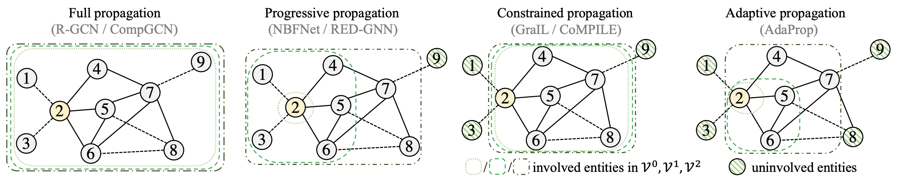

# AdaProp
Official code for the paper ["AdaProp: Learning Adaptive Propagation for Graph Neural Network based Knowledge Graph Reasoning"](https://arxiv.org/pdf/2205.15319.pdf) (KDD 2023).


## Introduction

Due to the popularity of Graph Neural Networks (GNNs), various GNN-based methods have been designed to reason on knowledge graphs (KGs). An important design component of GNN-based KG reasoning methods is called the propagation path, which contains a set of involved entities in each propagation step. Existing methods use hand-designed propagation paths, ignoring the correlation between the entities and the query relation. In addition, the number of involved entities will explosively grow at larger propagation steps.

In this work, we are motivated to learn an adaptive propagation path in order to filter out irrelevant entities while preserving promising targets. First, we design an incremental sampling mechanism where the nearby targets and layer-wise connections can be preserved with linear complexity. Second, we design a learning-based sampling distribution to identify the semantically related entities. Extensive experiments show that our method is powerful, efficient and semantic-aware.




## Dependencies

- torch == 1.12.1
- torch_scatter == 2.0.9
- numpy == 1.21.6
- scipy == 1.10.1


## Reproduction

### Transductive settings (in `\transductive`)

#### Reproduction with training scripts

##### Family dataset

```
python3 train.py --data_path ./data/family/ --train --topk 100 --layers 8 --fact_ratio 0.90 --gpu 0
```

##### UMLS dataset
```
python3 train.py --data_path ./data/umls/ --train --topk 100 --layers 5 --fact_ratio 0.90 --gpu 0
```

##### WN18RR dataset
```
python3 train.py --data_path ./data/WN18RR/ --train --topk 1000 --layers 8 --fact_ratio 0.96 --gpu 0
```

##### FB15k-237 dataset
```
python3 train.py --data_path ./data/fb15k-237/ --train --topk 2000 --layers 7 --fact_ratio 0.99 --remove_1hop_edges --gpu 0
```

##### NELL995 dataset
```
python3 train.py --data_path ./data/nell/ --train --topk 2000 --layers 6 --fact_ratio 0.95 --gpu 0
```

##### YAGO3-10 dataset
```
python3 train.py --data_path ./data/YAGO/ --train --topk 1000 --layers 8 --fact_ratio 0.995 --gpu 0
```


#### Reproduction with saved model checkpoints

##### Family dataset

```
python3 train.py --data_path ./data/family/ --eval --topk 100 --layers 8 --gpu 0 --weight ./data/family/8-layers-best.pt
```

##### UMLS dataset

```
python3 train.py --data_path ./data/umls/ --eval --topk 100 --layers 5 --gpu 0 --weight ./data/umls/5-layers-best.pt
```

##### WN18RR dataset

```
python3 train.py --data_path ./data/WN18RR/ --eval --topk 1000 --layers 8 --gpu 0 --weight ./data/WN18RR/8-layers-best.pt
```

##### FB15k-237 dataset

```
python3 train.py --data_path ./data/fb15k-237/ --eval --topk 2000 --layers 7 --gpu 0 --weight ./data/fb15k-237/7-layers-best.pt
```

##### NELL995 dataset

```
python3 train.py --data_path ./data/nell/ --eval --topk 2000 --layers 6 --gpu 0 --weight ./data/nell/6-layers-best.pt
```

##### YAGO3-10 dataset

```
python3 train.py --data_path ./data/YAGO/ --eval --topk 1000 --layers 8 --gpu 0 --weight ./data/YAGO/8-layers-best.pt
```

#### Results

| dataset  | Test MRR | Test Hit@1 | Test Hit@10 |
| -------- | -------- | ---------- | ----------- |
| Family   | 0.9882   | 0.9866     | 0.9903      |
| UMLS     | 0.9698   | 0.9558     | 0.9945      |
| WN18RR   | 0.5622   | 0.5086     | 0.6608      |
| FB15k-237| 0.4173   | 0.3312     | 0.5848      |
| NELL995  | 0.5542   | 0.4933     | 0.6526      |
| YAGO3-10 | 0.5738   | 0.5105     | 0.6865      |


### Inductive settings (in `\inductive`)

#### Reproduction with training scripts

The full training scripts can be found in [inductive/reproduce.sh](https://github.com/LARS-research/AdaProp/blob/main/inductive/reproduce.sh).

For example, training on `WN18RR v1` dataset:

```
python3 train.py --data_path ./data/WN18RR_v1
```


## Citation

If you find this repository useful in your research, please kindly cite our paper.

```
@inproceedings{zhang2023adaprop,
  title={AdaProp: Learning Adaptive Propagation for Graph Neural Network based Knowledge Graph Reasoning},
  author={Zhang, Yongqi and Zhou, Zhanke and Yao, Quanming and Chu, Xiaowen and Han, Bo},
  booktitle={KDD},
  year={2023}
}
```
